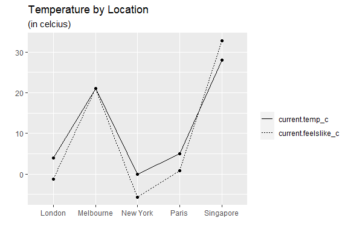

<!-- README.md is generated from README.Rmd. Please edit that file -->

# weatherapi

<!-- badges: start -->

[](https://app.circleci.com/pipelines/github/xintian927/534-project?filter=all)
<!-- badges: end -->

The goal of weatherapi is to wrap the weather api accessible through
weatherapi.com. This API enables us to get current and historical
weather information, astronomical information, local time-zone
information, and sports events information.

## Available functions:

-   `api_key()`: to set the API key for the package
-   `get_current_weather()`: to get the current real-time weather
    information for a location or multiple locations (e.g. Kelowna,
    Vancouver)
-   `get_time_zone()`: to get the current time-zone information for a
    location or multiple locations (e.g. Kelowna, Vancouver)
-   `get_sports_events()`: to get the sports events information for a
    location or multiple locations (e.g. Kelowna, Vancouver)
-   `get_astronomy()`: to get up to date information for sunrise,
    sunset, moonrise, moonset, and moonphase
-   `get_history_astro_information()`: to get historical information for
    sunrise, sunset, moonrise, moonset, and moonphase
-   `get_history_daily_weather()`: to get historical daily weather
    information
-   `get_history_hourly_weather()`: to get historical hourly weather
    information

## Installation

You can install the development version of weatherapi from
[GitHub](https://github.com/xintian927/534-project) with:

``` r
devtools::install_github("xintian927/534-project")
```

## Setup

This package relies on the API key provided by the Weather API. To get
started on using this package, please follow these steps:

1.  Sign-up for an account here:
    <https://www.weatherapi.com/signup.aspx>  
2.  Go to your “my account” page and copy your API key  
3.  Open RStudio and set your API key in the .Renviron file  
4.  You can do this by running the following code in your R console  
    `usethis::edit_r_environ()`  
5.  Then add this line inside the .Renviron file  
    `API_KEY = <your_api_key>`  
6.  Save and close the .Renviron file and you are good to go!

## Example

This is an example which shows you how to get the current weather
information:

``` r
library(weatherapi)
get_current_weather("Kelowna")
#>   location.name  location.region location.country location.lat location.lon
#> 1       Kelowna British Columbia           Canada         49.9      -119.48
#>      location.tz_id location.localtime_epoch location.localtime
#> 1 America/Vancouver               1645236553   2022-02-18 18:09
#>   current.last_updated_epoch current.last_updated current.temp_c current.temp_f
#> 1                 1645232400     2022-02-18 17:00              7           44.6
#>   current.is_day current.condition.text
#> 1              0          Partly cloudy
#>                             current.condition.icon current.condition.code
#> 1 //cdn.weatherapi.com/weather/64x64/night/116.png                   1003
#>   current.wind_mph current.wind_kph current.wind_degree current.wind_dir
#> 1              6.9             11.2                 170                S
#>   current.pressure_mb current.pressure_in current.precip_mm current.precip_in
#> 1                1022               30.17                 0                 0
#>   current.humidity current.cloud current.feelslike_c current.feelslike_f
#> 1               66            50                   7                44.6
#>   current.vis_km current.vis_miles current.uv current.gust_mph current.gust_kph
#> 1             14                 8          1              2.5                4
#>   current.air_quality.co current.air_quality.no2 current.air_quality.o3
#> 1                  250.3                     2.9                   57.2
#>   current.air_quality.so2 current.air_quality.pm2_5 current.air_quality.pm10
#> 1                     0.6                       0.8                      1.2
#>   current.air_quality.us.epa.index current.air_quality.gb.defra.index
#> 1                                1                                  1
```

You can also generate plots, for example:

``` r
library(ggplot2)
library(reshape2)

# Get current weather data
loc <- c("London", "New York", "Paris", "Melbourne", "Singapore") 
data <- get_current_weather(loc,"no")

# Get temperature info and melt dataframe
data <- data[c("location.name", "current.temp_c", "current.feelslike_c")]
data <- melt(data)

# Plot temperature
ggplot(data=data, aes(x=location.name, y=value, group=variable, linetype=variable)) +
  geom_line()+
  geom_point()+
  labs(title="Temperature by Location", subtitle="(in celcius)", x="", y="", linetype="")
```



## Getting help

If you encounter a clear bug, you can email us at:  
- <evelynsugihermanto@yahoo.com>  
- <lianqi20209@gmail.com>  
- <tjyh111@163.com>  
- <veeramanival@gmail.com>

------------------------------------------------------------------------

Please note that this project is released with a [Contributor Code of
Conduct](CODE_OF_CONDUCT.md). By participating in this project you agree
to abide by its terms.
